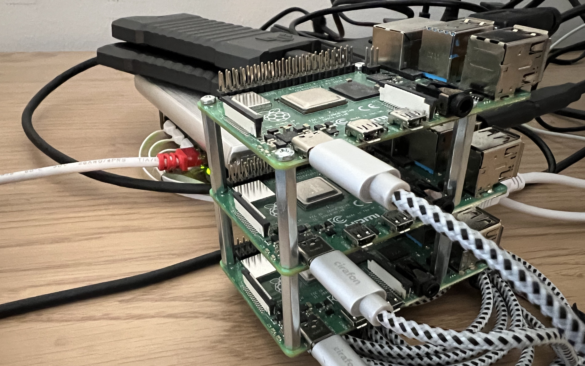
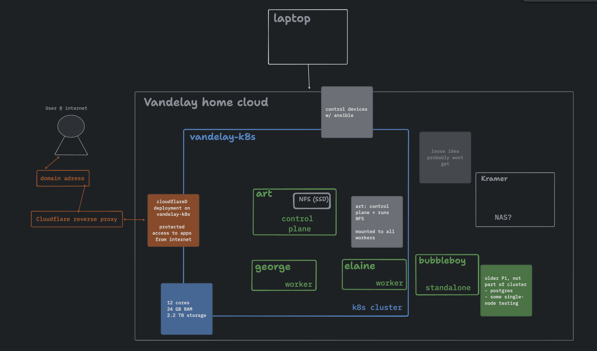

# My Personal Cloud
Referred to, as [*Vandelay Industries*](https://www.youtube.com/watch?v=Ugx06TlVyw4]), my personal cloud is based around a kubernetes cluster running on Raspberry Pi microcomputers mixed with using some public cloud components and other SaaS products.

What I'm looking to accomplish with my infrastructure
- Having fun tinkering!
- Personal data analytics infrastructure
- Try out OSS software in a low-stakes, fixed-cost environment
- Practical for hosting small dumb web app ideas that I tend to concieve

Image belows show some of the hardware used to power a kubernetes cluster consisting of three nodes (1 orchestrator, 2x workers)

    

## Requirements
### compute infrastructure
#### data engineering & analytics
- BI
- scheduling
- ETL
#### web applications & APIs
- self-made apps
  - golang
  - python
  - htmx
  - react
#### CI CD
- github runners?
#### FaaS
- run functions based on event queues?
### storage capabilities
#### databases
#### file storage
#### s3-like object storage

### Monitoring

### Maintainability
being able to re-install the cluster with somewhat ease

## Architecture Overview
Right now Vandelay Industries contains:
- Kubernetes cluster
- single-machine VM
- Cloudflare zero-trust to manage access to hosted apps

