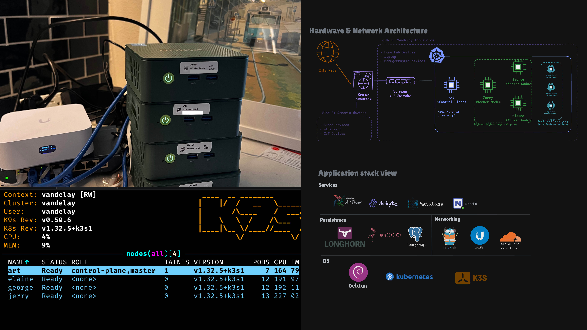

# My Personal Cloud
Referred to, as [*Vandelay Industries*](https://www.youtube.com/watch?v=Ugx06TlVyw4]), my personal home lab cloud is based around a Kubernetes cluster running on two sets of computers, with using some public cloud components and other SaaS products.

## Goals / Motivation
What I'm looking to accomplish with my infrastructure
- Having fun tinkering!
- My own personal data analytics infrastructure
- Try out OSS software in a low-stakes, fixed-cost environment
- Practical for hosting small dumb web app ideas that I tend to concieve

## Architecture Overview
Vandelay Industries is made up by:
- Router / gateway / firewall
- L2 Switch for fast networking between Nodes
- Kubernetes cluster 
  - 3 workers running on x86 with high memory & high disk space
  - to be added: work group of PIs that were peviously a standalone cluster -> low-powered low-storage energy efficent nodes
- Cloudflare zero-trust to manage access to hosted apps

Images below show some of the hardware used to power the K8s cluster, the raspberry pi compute part

    

