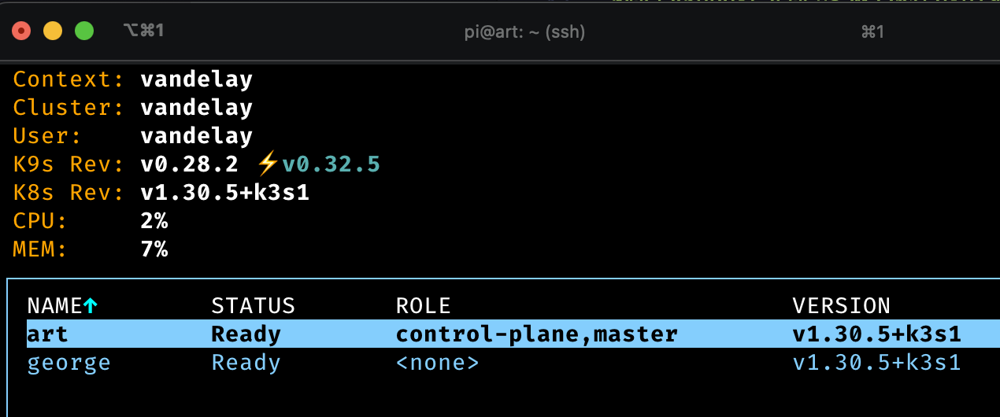

# Full setup guide for the home lab

## Networking
My current ISP Gigstreem seems to work in the whole building seamlessly with same SSID in my apartment and all around the amenities of the building. I believe households are on separate VLANs, but it still seems people are assigned IPs on same subnet. It obscures how I find and interact with other local devices on my network. The IP allocations are dynamic and out of my control. I therefore wanted to add another layer with my separate wifi network & VLANs

## Raspberry Pi Wi-Fi to Ethernet NAT Router: Complete Guide (AI summarized)
This guide configures a Raspberry Pi to act as a NAT router. It connects to an existing Wi-Fi network to get internet and shares that connection via its Ethernet port. This method creates a new, private sub-network, making it highly compatible with restrictive networks that may have "Client Isolation" enabled.

The final setup will have three distinct networks:
1.  **The Upstream Wi-Fi Network:** (e.g., `x.x.x.x`) - The source of the internet.
2.  **The Pi-to-Router Link Network:** `192.168.10.x` - A private link between the Pi and your router's WAN port.
3.  **Your Router's LAN:** (e.g., `10.10.0.x`) - The network your router creates for your end devices.

---

### Step 1: Initial System Setup and Wi-Fi Connection

Before you begin, ensure your Raspberry Pi is up to date and connected to your upstream Wi-Fi network.

1.  **Update Your System:**
    ```bash
    sudo apt-get update
    sudo apt-get upgrade -y
    ```
2.  **Connect to Wi-Fi:**
    Use the built-in configuration tool.
    ```bash
    sudo raspi-config
    ```
    Navigate to `System Options` > `Wireless LAN`, enter your Wi-Fi SSID and password, and finish. Reboot if necessary. Verify you have an internet connection with `ping -c 4 1.1.1.1`.

---

### Step 2: Configure a Static IP for the Ethernet Port

Assign a static IP to the Pi's Ethernet port (`eth0`) to act as the gateway for your downstream router.

1.  **Edit the DHCP Client Daemon Configuration:**
    This command appends the static IP configuration for `eth0` to the main configuration file.
    ```bash
    sudo tee -a /etc/dhcpcd.conf > /dev/null <<EOF

    # Configuration for eth0 as a router gateway
    interface eth0
    static ip_address=192.168.10.1/24
    nohook wpa_supplicant
    EOF
    ```
2.  **Apply the New Configuration:**
    ```bash
    sudo systemctl restart dhcpcd
    ```
    Verify the change with `ip addr show eth0`. You should see `inet 192.168.10.1/24`.

---

### Step 3: Install and Configure DHCP/DNS Server (dnsmasq)

Install and configure `dnsmasq` to automatically provide an IP address to whatever device is plugged into the Ethernet port.

1.  **Install dnsmasq:**
    ```bash
    sudo apt-get install dnsmasq -y
    ```
2.  **Create a New Configuration File:**
    This configuration tells `dnsmasq` how to manage the `eth0` network. We will use Cloudflare for upstream DNS.
    ```bash
    sudo tee /etc/dnsmasq.d/router.conf > /dev/null <<EOF
    # Only listen for requests on the Ethernet interface
    interface=eth0
    bind-interfaces

    # Set upstream DNS servers to Cloudflare
    server=1.1.1.1
    server=1.0.0.1

    # Define the IP range for DHCP leases
    dhcp-range=192.168.10.100,192.168.10.150,12h

    # Provide the router (gateway) address to clients
    dhcp-option=option:router,192.168.10.1

    # Provide the DNS server address to clients
    dhcp-option=option:dns-server,192.168.10.1
    EOF
    ```
3.  **Start and Enable the dnsmasq Service:**
    ```bash
    sudo systemctl start dnsmasq
    sudo systemctl enable dnsmasq
    ```

---

### Step 4: Enable Internet Routing (NAT)

Configure the Linux kernel to forward traffic and add a firewall rule to perform the Network Address Translation (NAT).

1.  **Install `iptables`:**
    The core firewall tool may not be installed by default.
    ```bash
    sudo apt-get install iptables -y
    ```
2.  **Enable Kernel IP Forwarding:**
    Create a configuration file to enable packet forwarding.
    ```bash
    echo "net.ipv4.ip_forward=1" | sudo tee /etc/sysctl.d/99-nat-forward.conf
    ```
3.  **Apply the Kernel Changes:**
    Load the new setting from all system configuration files.
    ```bash
    sudo sysctl --system
    ```
4.  **Create the NAT Rule in the Firewall:**
    This rule tells the Pi to rewrite traffic from the Ethernet port (`eth0`) so it appears to come from the Pi's Wi-Fi port (`wlan0`).
    ```bash
    sudo iptables -t nat -A POSTROUTING -o wlan0 -j MASQUERADE
    ```
5.  **Save the Firewall Rule Permanently:**
    Install `iptables-persistent` to save the rule and ensure it's re-applied after every reboot.
    ```bash
    sudo apt-get install iptables-persistent -y
    ```
    During the installation, a blue pop-up screen will appear. When prompted to save current IPv4 rules, select **`<Yes>`**. Do the same for the IPv6 rules prompt.

---

### Completion

Your Raspberry Pi is now a fully functional NAT router. You can connect your Ubiquiti Dream Router (or any other device) to the Pi's Ethernet port. It will be assigned an IP address (e.g., `192.168.10.100`) and have full internet access.

## Hardware
#### Router
Went with Ubiquiti Unifi Express 7, the Unifi apps are simple to use. it was simple to set up multiple VLANs and configure networking properly to keep my home lab separate from higher-risk devices such as IoT scale, vacuum cleaner, ..

#### Switches
- TP-link 8 port switch -- limited to gbit speed right now, but pc supports up to 2.5gbit
- 5-port Switch *D-LINK DGS-105* in inventory but not yet used

### Compute hardware
#### Node group: X86 Intel Alder lake
Picked up a couple of miniPCs on a black friday sale 2024. These GMKTec computers also offer upgradeability. ended up kitting them out in a serious manner with lots of memory and hard drive space. The idea is that this nodegroup is the backbone of the cluster & storage.

**Hardware specs:**
- 4x nodes: GMKTec N100 miniPC - 4 cores
  - Crucial SO-DIMM memory 32GB - 1 stick
  - NVME: Crucial p3 4TB
- power: included supply

#### Node group: ARM Raspberry PIs
This is my oldest cluster based on raspberry PI 4B, now with the x86 node group running, The idea is that this node group can be great for extra cores and low-power threads. Any pods that don't really require hooking up to serious PVCs and has ARM support could run on these nodes.

- All nodes: Raspberry Pi 4 Model B - 8GB RAM
- Master SSD:
  - Crucial *X8 SSD 500GB*
  - Sunguy USB type A -> type c gen 3.1
- Worker SSDs:
  - Kingston *NV2 M.2 NVMe Gen 4 1TB* (cheap on sale)
  - ASUS TUF NVMe SSD cabinet
  - Sunguy USB type A -> type c gen 3.1


### Misc components
#### Pi ndoe group Power
Linocell 50w brick, powers all the PIs just fine, as well as potentially the 4port switch

## OS & Setup
I've worked with the k3s distribution of kubernets the most through my escapades with the PIs, so even though there are other very interesting options these days, like Talos, I'm still sticking to that for now. This means that I'm good with a debian-style linux distro for my node groups.

### Intel node group
As mentioned, lets use [Debian](https://www.debian.org/). 

#### Prep USB
Using a samsung 128GB stick, [balenaEtcher](https://etcher.balena.io/#download-etcher) (make sure to choose the right release -- MacOS ARM64 in my case). putting the ISO onto the stick is super seasy.

#### OS Install
**TODO: Use some preconfigured image similar to raspberry pi imager**

Some settings during setup:
1. install, not graphical install
2. country,region,keymap
3. set it up with root and a user as: `node@<hostname>.vandelay`
4. central time for now. shouldnt matter? k3s should run in utc?
5. all system 1 partition
6. no desktop environment, add SSH

after restart, able to ssh using password `ssh node@<hostname>`

#### setup sudo
sudo is not there by default
```bash
# enter root
su -
# enter password

# install the sudo package
apt install sudo

# add user node to sudoers
adduser node sudo

# exit out X2 and re-ssh to node@<hostname>

# try it out
sudo ls
```

#### configure ssh
we want to only enable public key auth
```bash
mkdir -p .ssh
nano .ssh/authorized_keys
# paste your key(s)
```
now find lines and change the following

```bash
sudo nano /etc/ssh/sshd_config
```
the settings should be like this:
```conf
PubkeyAuthentication yes
PasswordAuthentication no
ChallengeResponseAuthentication no
PermitRootLogin no 
```

now restart ssh service
```bash
sudo systemctl restart sshd
```

#### prep k3s
Install some packages required
```bash
sudo apt install open-iscsi curl -y
```
## Kubernetes & Setup
### Set static IPs
I use Unifi to configure the nodes to have a static IP address / domains to simplify things.

### Master node
```bash
curl -sfL https://get.k3s.io | sh -

# show token of master node
cat /var/lib/rancher/k3s/server/node-token
```
### Worker Nodes
```bash
export K3S_URL=https://art.vandelay:6443
export K3S_TOKEN=<OUTPUT FROM PREVIOUS>

# now can connect
curl -sfL https://get.k3s.io | sh -
```

### Add cluster to context
on master: 
```bash
# show the kubeconfig content so you can add to laptop kube contexts
sudo cat /etc/rancher/k3s/k3s.yaml
```

useful to run kubectl commands from laptop on local network
https://kubernetes.io/docs/tasks/access-application-cluster/configure-access-multiple-clusters/

I use k9s to manage my deployment


### Networking / Load balancer / Ingress
Out of the box, the cluster should now leverage Traefik to give us a type of loadbalancer capabilities. 

I was previously using Metal-LB to create services with exposed external IP addresses in the VLAN IP network. 

With the out-of-box setup however, I should be able to do subdomains with an ingress


#### Add A record to router DNS options
in this case, I added `*.vandelay` as an A-record and pointed it to one of the nodes (`art` in this case)

#### Test using sample Nginx deployment
Lets try to deploy a simple nginx pod, with an ingress, to see whether things are working.

- nginx pod
- service
- ingress

```bash
kubectl apply -f cloud_setup/networking_test/deployment.yaml
# optional: check by port-forwarding the ClusterIP service

# apply ingress
kubectl apply -f cloud_setup/networking_test/ingress.yaml
```

Once the ingress has kicked in properly, should be able to resolve at `https://nginx-test.vandelay`

### Persistence & statefulness
I want to be able to run stateful services (e.g. databases, object storage, ...) without services being tied to a specific pod.

[Longhorn](https://longhorn.io) has solved this problem for me.

#### label intel worker nodes / control plane
```bash
kubectl taint nodes art node-role.kubernetes.io/control-plane:NoSchedule
```

node labels for worker nodes
```bash
kubectl label node george node-type=big
kubectl label node elaine node-type=big
kubectl label node jerry node-type=big
```

#### Install longhorn chart
using helm to install longhorn. not really doing any special considerations yet beyond the tainting of control plane node.

```bash
bash cloud_setup/persistence/upgrade-longhorn.sh
```
by port-forwarding to the `longhorn-frontend` service we should reach the GUI and can check things


#### Setup Ingress with  middleware on the GUI endpoint
Traefik has a concept of Middleware and different options. I wanted to at least have some layer of protection even though the endpoint is only available in my local VLAN.

```bash
# create secret (uses 1password CLI)
bash cloud_setup/persistence/create-secret.sh

# apply middleware + ingress
kubectl apply -f cloud_setup/persistence/longhorn-ingress.yaml
```

#### Verify the persistence setup
small experiment:
- create PVC
- pod test-writer runs a busybox to create a test file with small content, on specific node, `george`
- pod test-reader runs busybox, reads test file content, runs on other node `elaine`

```bash
kubectl apply -f cloud_setup/persistence/verification-test-pvc.yaml

kubectl apply -f cloud_setup/persistence/verification-test-write.yaml

# check logs / attatch to pod once up and running, if happy, delete pod
kubectl delete -f cloud_setup/persistence/verification-test-write.yaml

# create reader and check
kubectl apply -f cloud_setup/persistence/verification-test-read.yaml

# check logs / attach

# TARE DOWN
kubectl delete -f cloud_setup/persistence/verification-test-write.yaml
kubectl delete -f cloud_setup/persistence/verification-test-pvc.yaml
```

### Object Storage
most apps need some type of s3-compliant s3 interface so i view it as core infra on my home cloud. Using [minio](https://min.io/docs/minio/kubernetes/upstream/operations/deploy-manage-tenants.html) to achieve this on the cluster in conjunction with longhorn storing underlying PVCs

#### Installing MinIO operator
I'm used to working with helm chart or kustomize. the [docs](https://min.io/docs/minio/kubernetes/upstream/operations/installation.html) describe deploying and controlling MinIO using their operator / CRD
```bash
# deploys operator to minio-operator NS
kubectl apply -k "github.com/minio/operator?ref=v5.0.18"
```
#### Installing mino cluster
used the command in docs to generate a base deployment file
- rolling my own secret gen script using 1pw
- changing ns to minio
- no storage-user account yet, will click-ops
- Had to experiment with deployment.yaml, i chose not to use the built-in TLS management, instead I'll use traefik and add cert manager in the longer term

```
# create ns
kubectl create ns minio

# create secret
bash cloud_setup/object_storage/create_secret.sh


# create minio deployment
kubectl apply -f cloud_setup/object_storage/deployment.yaml

kubectl apply -f cloud_setup/object_storage/ingress.yaml
```

### CloudflareD
for exposing services
```bash
kubectl create ns cloudflare
bash cloud_setup/networking_external/generate_secret.sh

kubectl apply -f cloud_setup/networking_external/deployment.yaml
```


### Monitoring
for now will wait to see what options I have and feel out what I actually need

## Maintenance / updates

### Node OS Maintenance (Debian/Raspberry Pi)
To keep the underlying nodes secure, perform regular package updates.
**Note:** Since the cluster uses a single master node (`art`), rebooting it will cause temporary API downtime. Worker node workloads will continue to run, but no new pods can be scheduled.

0. **Pre-flight Health Check:**
   ```bash
   kubectl get nodes
   kubectl get pods -A | grep -v Running
   ```

1. **Manual Update:**
   ```bash
   sudo apt update && sudo apt upgrade -y
   # If prompted about /etc/ssh/sshd_config, choose "keep the local version currently installed"
   sudo apt autoremove -y
   ```
2. **Automated Security Patches:**
   It is recommended to install `unattended-upgrades` to ensure critical security patches are applied automatically.
   ```bash
   sudo apt install unattended-upgrades
   sudo dpkg-reconfigure --priority=low unattended-upgrades
   ```
3. **Kernel Updates:**
   After a kernel update, a reboot is required. Check if `/var/run/reboot-required` exists.

### Cluster Update Workflow (Rolling)
To minimize downtime and ensure Longhorn volumes migrate safely, follow this order:

#### 1. Master Node (art)
Since it's a single master, this causes temporary API downtime.
1. Perform OS updates.
2. Back up the database: `sudo cp -r /var/lib/rancher/k3s/server/db /tmp/k3s-db-backup-$(date +%Y%m%d)`
3. Upgrade k3s:
   ```bash
   curl -sfL https://get.k3s.io | INSTALL_K3S_CHANNEL=stable sh -
   ```
4. Reboot if necessary.

#### 2. Worker Nodes (One-by-one)
Repeat these steps for `george`, `elaine`, and `jerry`:

1. **Drain from your laptop/master:**
   ```bash
   kubectl drain <node-name> --ignore-daemonsets --delete-emptydir-data
   ```
2. **On the worker node:**
   - Run OS updates: `sudo apt update && sudo apt upgrade -y`
   - Upgrade k3s:
   ```bash
   curl -sfL https://get.k3s.io | INSTALL_K3S_CHANNEL=stable K3S_URL=https://art.vandelay:6443 K3S_TOKEN=<TOKEN> sh -
   ```
   - Reboot node.
3. **Uncordon from your laptop/master:**
   ```bash
   kubectl uncordon <node-name>
   ```

### Longhorn Upgrades
Longhorn should be updated via Helm. Since it manages your data, verify health before starting.


1. **Health Check:** Open the Longhorn UI and ensure all volumes are `Healthy`. Do not upgrade if any volumes are `Rebuilding` or `Degraded`.
2. **Check/change version on Update Script**
   had to visit https://github.com/longhorn/longhorn and only possible to go minor version at a time
   file: `cloud_setup/persistence/upgrade-longhorn.sh`
3. **Run Upgrade Script:**
   ```bash
   bash cloud_setup/persistence/upgrade-longhorn.sh
   ```
4. **Post-Upgrade:**
   - Monitor the `longhorn-system` namespace to ensure all pods (especially `instance-manager` and `longhorn-manager`) restart successfully.
   - Check the UI again to ensure volumes remain attached and healthy.

### Certificates
k3s automatically rotates its internal certificates. To check expiration:
```bash
sudo k3s check-config
```
