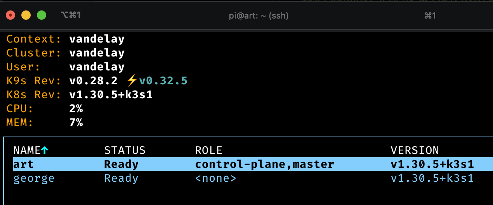

# Full setup guide for the home lab

Hardware, the rack and the home network live in [hardware/](../hardware/README.md). This guide covers the nodes' OS, k3s and the core cluster services.

## OS & Setup
I've worked with the k3s distribution of kubernets the most through my escapades with the PIs, so even though there are other very interesting options these days, like Talos, I'm still sticking to that for now. This means that I'm good with a debian-style linux distro for my node groups.

### Intel node group
As mentioned, lets use [Debian](https://www.debian.org/). 

#### Prep USB
Using a samsung 128GB stick, [balenaEtcher](https://etcher.balena.io/#download-etcher) (make sure to choose the right release -- MacOS ARM64 in my case). putting the ISO onto the stick is super seasy.

#### OS Install
**TODO: Use some preconfigured image similar to raspberry pi imager**

Some settings during setup:
1. install, not graphical install
2. country,region,keymap
3. set it up with root and a user as: `node@<hostname>.vandelay`
4. central time for now. shouldnt matter? k3s should run in utc?
5. all system 1 partition
6. no desktop environment, add SSH

after restart, able to ssh using password `ssh node@<hostname>`

#### setup sudo
sudo is not there by default
```bash
# enter root
su -
# enter password

# install the sudo package
apt install sudo

# add user node to sudoers
adduser node sudo

# exit out X2 and re-ssh to node@<hostname>

# try it out
sudo ls
```

#### configure ssh
we want to only enable public key auth
```bash
mkdir -p .ssh
nano .ssh/authorized_keys
# paste your key(s)
```
now find lines and change the following

```bash
sudo nano /etc/ssh/sshd_config
```
the settings should be like this:
```conf
PubkeyAuthentication yes
PasswordAuthentication no
ChallengeResponseAuthentication no
PermitRootLogin no 
```

now restart ssh service
```bash
sudo systemctl restart sshd
```

#### prep k3s
Install some packages required
```bash
sudo apt install open-iscsi curl -y
```
## Kubernetes & Setup
### Set static IPs
I use Unifi to configure the nodes to have a static IP address / domains to simplify things.

### Master node
```bash
curl -sfL https://get.k3s.io | sh -

# show token of master node
cat /var/lib/rancher/k3s/server/node-token
```
### Worker Nodes
```bash
export K3S_URL=https://art.vandelay:6443
export K3S_TOKEN=<OUTPUT FROM PREVIOUS>

# now can connect
curl -sfL https://get.k3s.io | sh -
```

### Add cluster to context
on master: 
```bash
# show the kubeconfig content so you can add to laptop kube contexts
sudo cat /etc/rancher/k3s/k3s.yaml
```

useful to run kubectl commands from laptop on local network
https://kubernetes.io/docs/tasks/access-application-cluster/configure-access-multiple-clusters/

I use k9s to manage my deployment


### Networking / Load balancer / Ingress
Out of the box, the cluster should now leverage Traefik to give us a type of loadbalancer capabilities. 

I was previously using Metal-LB to create services with exposed external IP addresses in the VLAN IP network. 

With the out-of-box setup however, I should be able to do subdomains with an ingress


#### Add A record to router DNS options
in this case, I added `*.vandelay` as an A-record and pointed it to one of the nodes (`art` in this case)

#### Test using sample Nginx deployment
Lets try to deploy a simple nginx pod, with an ingress, to see whether things are working.

- nginx pod
- service
- ingress

```bash
kubectl apply -f cloud_setup/networking_test/deployment.yaml
# optional: check by port-forwarding the ClusterIP service

# apply ingress
kubectl apply -f cloud_setup/networking_test/ingress.yaml
```

Once the ingress has kicked in properly, should be able to resolve at `https://nginx-test.vandelay`

### Persistence & statefulness
I want to be able to run stateful services (e.g. databases, object storage, ...) without services being tied to a specific pod.

[Longhorn](https://longhorn.io) has solved this problem for me.

#### label intel worker nodes / control plane
```bash
kubectl taint nodes art node-role.kubernetes.io/control-plane:NoSchedule
```

node labels for worker nodes
```bash
kubectl label node george node-type=big
kubectl label node elaine node-type=big
kubectl label node jerry node-type=big
```

#### Install longhorn chart
using helm to install longhorn. not really doing any special considerations yet beyond the tainting of control plane node.

```bash
bash cloud_setup/persistence/upgrade-longhorn.sh
```
by port-forwarding to the `longhorn-frontend` service we should reach the GUI and can check things


#### Setup Ingress with  middleware on the GUI endpoint
Traefik has a concept of Middleware and different options. I wanted to at least have some layer of protection even though the endpoint is only available in my local VLAN.

```bash
# create secret (uses 1password CLI)
bash cloud_setup/persistence/create-secret.sh

# apply middleware + ingress
kubectl apply -f cloud_setup/persistence/longhorn-ingress.yaml
```

#### Verify the persistence setup
small experiment:
- create PVC
- pod test-writer runs a busybox to create a test file with small content, on specific node, `george`
- pod test-reader runs busybox, reads test file content, runs on other node `elaine`

```bash
kubectl apply -f cloud_setup/persistence/verification-test-pvc.yaml

kubectl apply -f cloud_setup/persistence/verification-test-write.yaml

# check logs / attatch to pod once up and running, if happy, delete pod
kubectl delete -f cloud_setup/persistence/verification-test-write.yaml

# create reader and check
kubectl apply -f cloud_setup/persistence/verification-test-read.yaml

# check logs / attach

# TARE DOWN
kubectl delete -f cloud_setup/persistence/verification-test-write.yaml
kubectl delete -f cloud_setup/persistence/verification-test-pvc.yaml
```

### Object Storage
most apps need some type of s3-compliant s3 interface so i view it as core infra on my home cloud. Using [minio](https://min.io/docs/minio/kubernetes/upstream/operations/deploy-manage-tenants.html) to achieve this on the cluster in conjunction with longhorn storing underlying PVCs

#### Installing MinIO operator
I'm used to working with helm chart or kustomize. the [docs](https://min.io/docs/minio/kubernetes/upstream/operations/installation.html) describe deploying and controlling MinIO using their operator / CRD
```bash
# deploys operator to minio-operator NS
kubectl apply -k "github.com/minio/operator?ref=v5.0.18"
```
#### Installing mino cluster
used the command in docs to generate a base deployment file
- rolling my own secret gen script using 1pw
- changing ns to minio
- no storage-user account yet, will click-ops
- Had to experiment with deployment.yaml, i chose not to use the built-in TLS management, instead I'll use traefik and add cert manager in the longer term

```
# create ns
kubectl create ns minio

# create secret
bash cloud_setup/object_storage/create_secret.sh


# create minio deployment
kubectl apply -f cloud_setup/object_storage/deployment.yaml

kubectl apply -f cloud_setup/object_storage/ingress.yaml
```

### CloudflareD
for exposing services
```bash
kubectl create ns cloudflare
bash cloud_setup/networking_external/generate_secret.sh

kubectl apply -f cloud_setup/networking_external/deployment.yaml
```


### Monitoring
[kube-prometheus-stack](https://github.com/prometheus-community/helm-charts/tree/main/charts/kube-prometheus-stack): Prometheus (via the Prometheus Operator), Grafana, node-exporter (DaemonSet, one pod per node) and kube-state-metrics. Started for the [temps & power project](../hardware/thermals_power/thermals_power_2026-Q4.md).

k3s specifics in [values.yaml](monitoring/values.yaml):
- controller-manager, scheduler, proxy and etcd live inside the k3s binary, so their monitors are disabled
- node-exporter's init container makes RAPL readable, for CPU package watts
- Prometheus: 30s scrapes, 90d retention, 30Gi Longhorn volume

```bash
# needs a "grafana" item with a password in the vandelay 1Password vault
bash cloud_setup/monitoring/create-secret.sh

helm repo add prometheus-community https://prometheus-community.github.io/helm-charts
helm repo update
bash cloud_setup/monitoring/install-upgrade.sh
```

Check:
```bash
# node-exporter on all 4 nodes (art too - it tolerates the control-plane taint)
kubectl -n monitoring get pods -o wide

# Prometheus targets page: everything should be UP
kubectl -n monitoring port-forward svc/kube-prometheus-stack-prometheus 9090
# -> http://localhost:9090/targets
```
Grafana at `http://grafana.vandelay`, login from 1Password. "Node Exporter / Nodes" is the starting dashboard.

Own dashboards live as JSON in [monitoring/dashboards](monitoring/dashboards/), wrapped in ConfigMaps the Grafana sidecar picks up:
```bash
kubectl apply -k cloud_setup/monitoring/dashboards
```
- "Vandelay / Overview": high level - hottest CPU/NVMe, usage, k8s requests vs allocatable, Longhorn volume health
- "Vandelay / Thermals & Power": temps, RAPL watts, throttling and load for all nodes side by side

Longhorn metrics (volume robustness, node/disk status) need their own ServiceMonitor - the Longhorn chart doesn't create one by default:
```bash
kubectl apply -f cloud_setup/monitoring/longhorn-servicemonitor.yaml
```

UI edits to a provisioned dashboard don't stick - Export -> JSON, save over the file and re-apply.

Upgrades: `helm upgrade` doesn't touch CRDs. On a major chart version bump, apply the new CRDs first (see the chart's upgrade notes), then bump `CHART_VERSION` in [install-upgrade.sh](monitoring/install-upgrade.sh).

## Maintenance / updates

### Node OS Maintenance (Debian/Raspberry Pi)
To keep the underlying nodes secure, perform regular package updates.
**Note:** Since the cluster uses a single master node (`art`), rebooting it will cause temporary API downtime. Worker node workloads will continue to run, but no new pods can be scheduled.

0. **Pre-flight Health Check:**
   ```bash
   kubectl get nodes
   kubectl get pods -A | grep -v Running
   ```

1. **Manual Update:**
   ```bash
   sudo apt update && sudo apt upgrade -y
   # If prompted about /etc/ssh/sshd_config, choose "keep the local version currently installed"
   sudo apt autoremove -y
   ```
2. **Automated Security Patches:**
   It is recommended to install `unattended-upgrades` to ensure critical security patches are applied automatically.
   ```bash
   sudo apt install unattended-upgrades
   sudo dpkg-reconfigure --priority=low unattended-upgrades
   ```
3. **Kernel Updates:**
   After a kernel update, a reboot is required. Check if `/var/run/reboot-required` exists.

### Cluster Update Workflow (Rolling)
To minimize downtime and ensure Longhorn volumes migrate safely, follow this order:

#### 1. Master Node (art)
Since it's a single master, this causes temporary API downtime.
1. Perform OS updates.
2. Back up the database: `sudo cp -r /var/lib/rancher/k3s/server/db /tmp/k3s-db-backup-$(date +%Y%m%d)`
3. Upgrade k3s:
   ```bash
   curl -sfL https://get.k3s.io | INSTALL_K3S_CHANNEL=stable sh -
   ```
4. Reboot if necessary.

#### 2. Worker Nodes (One-by-one)
Repeat these steps for `george`, `elaine`, and `jerry`:

1. **Drain from your laptop/master:**
   ```bash
   kubectl drain <node-name> --ignore-daemonsets --delete-emptydir-data
   ```
2. **On the worker node:**
   - Run OS updates: `sudo apt update && sudo apt upgrade -y`
   - Upgrade k3s:
   ```bash
   curl -sfL https://get.k3s.io | INSTALL_K3S_CHANNEL=stable K3S_URL=https://art.vandelay:6443 K3S_TOKEN=<TOKEN> sh -
   ```
   - Reboot node.
3. **Uncordon from your laptop/master:**
   ```bash
   kubectl uncordon <node-name>
   ```

### Longhorn Upgrades
Longhorn should be updated via Helm. Since it manages your data, verify health before starting.


1. **Health Check:** Open the Longhorn UI and ensure all volumes are `Healthy`. Do not upgrade if any volumes are `Rebuilding` or `Degraded`.
2. **Check/change version on Update Script**
   had to visit https://github.com/longhorn/longhorn and only possible to go minor version at a time
   file: `cloud_setup/persistence/upgrade-longhorn.sh`
3. **Run Upgrade Script:**
   ```bash
   bash cloud_setup/persistence/upgrade-longhorn.sh
   ```
4. **Post-Upgrade:**
   - Monitor the `longhorn-system` namespace to ensure all pods (especially `instance-manager` and `longhorn-manager`) restart successfully.
   - Check the UI again to ensure volumes remain attached and healthy.

### Certificates
k3s automatically rotates its internal certificates. To check expiration:
```bash
sudo k3s check-config
```
