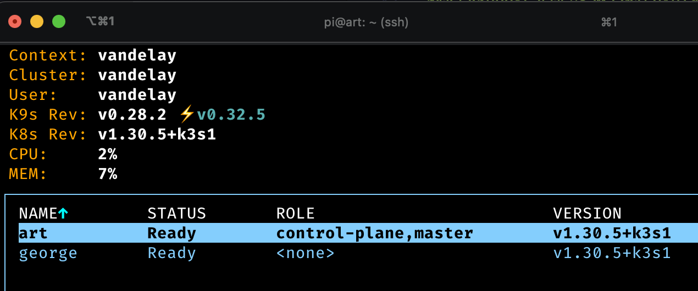

# Full setup guide for the home lab

## Hardware
### Networking
My current ISP Gigstreem seems to work in the whole building seamlessly with same SSID in my apartment and all around the amenities of the building. I believe households are on separate VLANs, but it still seems people are assigned IPs on same subnet. It obscures how I find and interact with other local devices on my network. The IP allocations are dynamic and out of my control. I therefore wanted to add another layer with my separate wifi network & VLANs

#### Router
Went with Ubiquiti Unifi Express 7, the Unifi apps are simple to use. it was simple to set up multiple VLANs and configure networking properly to keep my home lab separate from higher-risk devices such as IoT scale, vacuum cleaner, ..

#### Switches
- TP-link 8 port switch -- limited to gbit speed right now, but pc supports up to 2.5gbit
- 5-port Switch *D-LINK DGS-105* in inventory but not yet used

### Compute hardware
#### Node group: X86 Intel Alder lake
Picked up a couple of miniPCs on a black friday sale 2024. These GMKTec computers also offer upgradeability. ended up kitting them out in a serious manner with lots of memory and hard drive space. The idea is that this nodegroup is the backbone of the cluster & storage.

**Hardware specs:**
- 4x nodes: GMKTec N100 miniPC - 4 cores
  - Crucial SO-DIMM memory 32GB - 1 stick
  - NVME: Crucial p3 4TB
- power: included supply

#### Node group: ARM Raspberry PIs
This is my oldest cluster based on raspberry PI 4B, now with the x86 node group running, The idea is that this node group can be great for extra cores and low-power threads. Any pods that don't really require hooking up to serious PVCs and has ARM support could run on these nodes.

- All nodes: Raspberry Pi 4 Model B - 8GB RAM
- Master SSD:
  - Crucial *X8 SSD 500GB*
  - Sunguy USB type A -> type c gen 3.1
- Worker SSDs:
  - Kingston *NV2 M.2 NVMe Gen 4 1TB* (cheap on sale)
  - ASUS TUF NVMe SSD cabinet
  - Sunguy USB type A -> type c gen 3.1


### Misc components
#### Pi ndoe group Power
Linocell 50w brick, powers all the PIs just fine, as well as potentially the 4port switch

## OS & Setup
I've worked with the k3s distribution of kubernets the most through my escapades with the PIs, so even though there are other very interesting options these days, like Talos, I'm still sticking to that for now. This means that I'm good with a debian-style linux distro for my node groups.

### Intel node group
As mentioned, lets use [Debian](https://www.debian.org/). 

#### Prep USB
Using a samsung 128GB stick, [balenaEtcher](https://etcher.balena.io/#download-etcher) (make sure to choose the right release -- MacOS ARM64 in my case). putting the ISO onto the stick is super seasy.

#### OS Install
**TODO: Use some preconfigured image similar to raspberry pi imager**

Some settings during setup:
1. install, not graphical install
2. country,region,keymap
3. set it up with root and a user as: `node@<hostname>.vandelay`
4. central time for now. shouldnt matter? k3s should run in utc?
5. all system 1 partition
6. no desktop environment, add SSH

after restart, able to ssh using password `ssh node@<hostname>`

#### setup sudo
sudo is not there by default
```bash
# enter root
su -
# enter password

# install the sudo package
apt install sudo

# add user node to sudoers
adduser node sudo

# exit out X2 and re-ssh to node@<hostname>

# try it out
sudo ls
```

#### configure ssh
we want to only enable public key auth
```bash
mkdir -p .ssh
nano .ssh/authorized_keys
# paste your key(s)
```
now find lines and change the following

```bash
sudo nano /etc/ssh/sshd_config
```
the settings should be like this:
```conf
PubkeyAuthentication yes
PasswordAuthentication no
ChallengeResponseAuthentication no
PermitRootLogin no 
```

now restart ssh service
```bash
sudo systemctl restart sshd
```

#### prep k3s
Install some packages required
```bash
sudo apt install open-iscsi curl -y
```
## Kubernetes & Setup
### Set static IPs
I use Unifi to configure the nodes to have a static IP address / domains to simplify things.

### Master node
```bash
curl -sfL https://get.k3s.io | sh -

# show token of master node
cat /var/lib/rancher/k3s/server/node-token
```
### Worker Nodes
```bash
export K3S_URL=https://art.vandelay:6443
export K3S_TOKEN=<OUTPUT FROM PREVIOUS>

# now can connect
curl -sfL https://get.k3s.io | sh -
```

### Add cluster to context
on master: 
```bash
# show the kubeconfig content so you can add to laptop kube contexts
sudo cat /etc/rancher/k3s/k3s.yaml
```

useful to run kubectl commands from laptop on local network
https://kubernetes.io/docs/tasks/access-application-cluster/configure-access-multiple-clusters/

I use k9s to manage my deployment


### Networking / Load balancer / Ingress
Out of the box, the cluster should now leverage Traefik to give us a type of loadbalancer capabilities. 

I was previously using Metal-LB to create services with exposed external IP addresses in the VLAN IP network. 

With the out-of-box setup however, I should be able to do subdomains with an ingress


#### Add A record to router DNS options
in this case, I added `*.vandelay` as an A-record and pointed it to one of the nodes (`art` in this case)

#### Test using sample Nginx deployment
Lets try to deploy a simple nginx pod, with an ingress, to see whether things are working.

- nginx pod
- service
- ingress

```bash
kubectl apply -f cloud_setup/networking_test/deployment.yaml
# optional: check by port-forwarding the ClusterIP service

# apply ingress
kubectl apply -f cloud_setup/networking_test/ingress.yaml
```

Once the ingress has kicked in properly, should be able to resolve at `https://nginx-test.vandelay`

### Persistence & statefulness
I want to be able to run stateful services (e.g. databases, object storage, ...) without services being tied to a specific pod.

[Longhorn](https://longhorn.io) has solved this problem for me.

#### label intel worker nodes / control plane
```bash
kubectl taint nodes art node-role.kubernetes.io/control-plane:NoSchedule
```


## Maintenance / updates