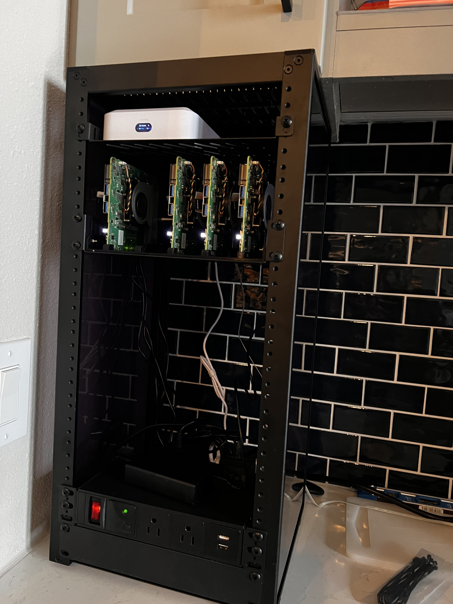
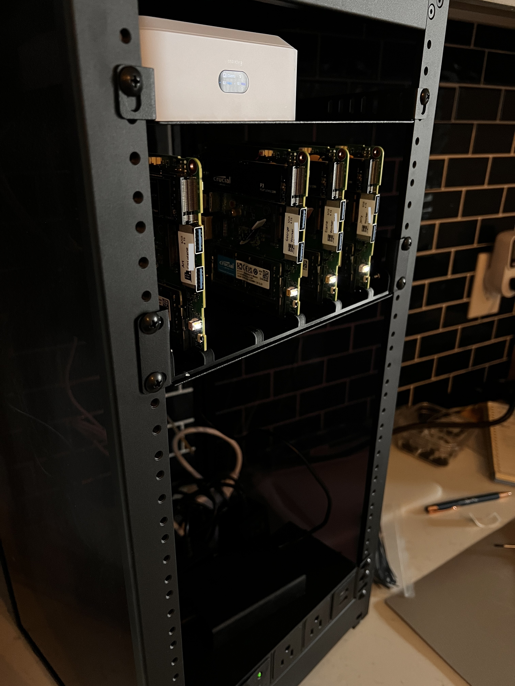
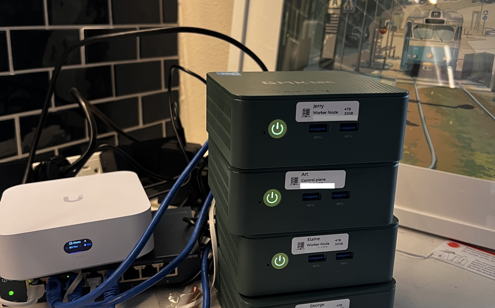
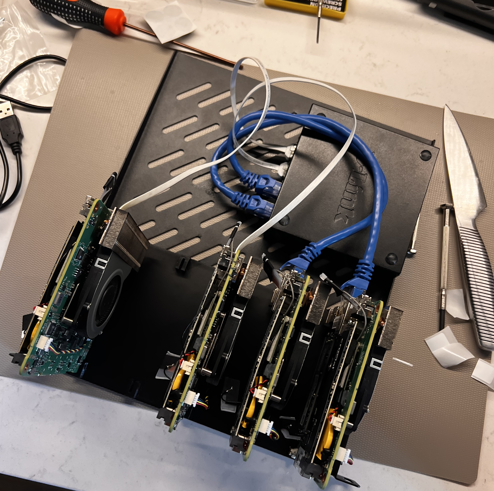
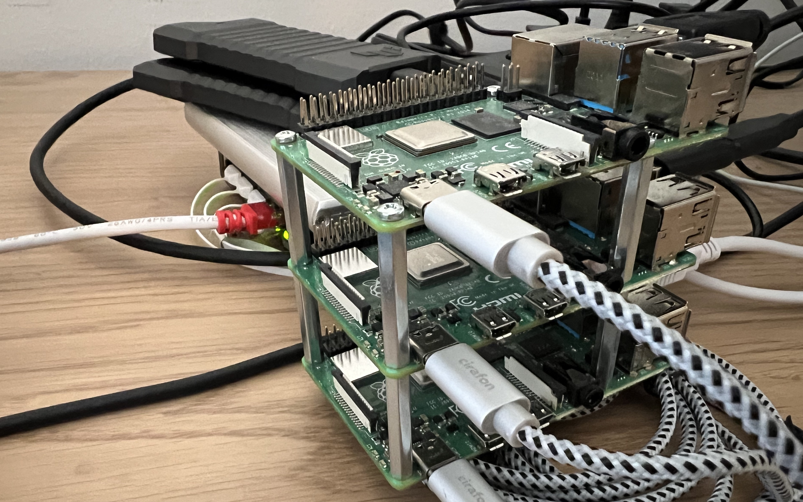

# Hardware
The physical side of Vandelay Industries: the rack, power, home network and the nodes the k3s cluster runs on. Cluster and software setup lives in [cloud_setup](../cloud_setup/README.md).

    
    

| Doc | What's in it |
|---|---|
| [rack_mount_setup/rack_mounting_2026-Q4.md](rack_mount_setup/rack_mounting_2026-Q4.md) | Rack project: as-built layout, original plan, blade mount sizing, power plan, orders, to-dos |
| [networking.md](networking.md) | Why the lab has its own network, and the bridge Pi NAT router guide (fallback, not in use) |
| [legacy_work/hardware](../legacy_work/hardware/README.md) | Older Pi-era inventory and drive benchmarks (Pi USB SSDs vs the N100 NVMe) |

## Rack
GeeekPi DeskPi RackMate T2: 12U, 10" wide, open front/back with acrylic sides. Moved in 2026-10, phase 1 layout top to bottom:

| Position | What |
|---|---|
| Top, ~2U | Router (UniFi Express 7) on a shelf |
| Below router, ~3U | 4 N100 blades in a 3D printed 5-slot mount on the 1U shelf, switch on the same shelf behind them |
| Middle | Open - power cables run down to the bottom. Room for the Pi node group later |
| Bottom | Node power bricks, on top of the PDU |
| U1 | 1U AC PDU |

Details, the original plan and what's still to do: [rack doc](rack_mount_setup/rack_mounting_2026-Q4.md).

## Power
One mains cord into a 1U AC PDU at the bottom of the rack (4 rear + 2 front outlets, 2x USB-A, surge protected). The nodes still run on their stock 12V 3A bricks, which sit at the bottom of the rack and plug into the PDU.

Outlet plan, power draw estimates and the possible move to a single 12V supply: [rack doc, Power](rack_mount_setup/rack_mounting_2026-Q4.md#power).

## Networking
Wall Ethernet -> router -> switch -> nodes. The wall Ethernet is working again (2026-10), so the bridge Pi is stored away. If the wall jack drops out again, the bridge Pi gets the router online over the building Wi-Fi instead; setup in [networking.md](networking.md).

#### Router
Went with Ubiquiti Unifi Express 7 (Kramer), the Unifi apps are simple to use. it was simple to set up multiple VLANs and configure networking properly to keep my home lab separate from higher-risk devices such as IoT scale, vacuum cleaner, ..

Node static IPs and the `*.vandelay` DNS record are set in Unifi too, see [cloud_setup](../cloud_setup/README.md#set-static-ips).

#### Switches
- D-Link DGS-105, 5 port - in the rack on the blade shelf. 4 nodes + uplink fills it
- TP-link 8 port switch -- limited to gbit speed, but the nodes support up to 2.5gbit

## Compute
### Node group: x86 Intel N100
Picked up a couple of miniPCs on a black friday sale 2024. These GMKTec computers also offer upgradeability. ended up kitting them out in a serious manner with lots of memory and hard drive space. The idea is that this nodegroup is the backbone of the cluster & storage.

Stripped out of their cases and mounted as blades in the rack, in slot order:

| Slot | Node | Role |
|---|---|---|
| 1 | Art | Control plane |
| 2 | - | Spare |
| 3 | George | Worker |
| 4 | Elaine | Worker |
| 5 | Jerry | Worker |

**Hardware specs:**
- 4x nodes: GMKtec NucBox G3, Intel N100 - 4 cores
  - Crucial SO-DIMM memory 32GB - 1 stick
  - NVME: Crucial p3 4TB
- power: included 12V 3A brick

Cased on the desk before the rack (left) and as blades on the rack shelf (right):

    
    

### Node group: ARM Raspberry PIs
This is my oldest cluster based on raspberry PI 4B, now with the x86 node group running, The idea is that this node group can be great for extra cores and low-power threads. Any pods that don't really require hooking up to serious PVCs and has ARM support could run on these nodes. Not in the rack yet - planned for phase 2 (Frank, Morty, Newman).

    

- All nodes: Raspberry Pi 4 Model B - 8GB RAM
- Master SSD:
  - Crucial *X8 SSD 500GB*
  - Sunguy USB type A -> type c gen 3.1
- Worker SSDs:
  - Kingston *NV2 M.2 NVMe Gen 4 1TB* (cheap on sale)
  - ASUS TUF NVMe SSD cabinet
  - Sunguy USB type A -> type c gen 3.1
- Power: Linocell 50w brick, powers all the PIs just fine, as well as potentially the 4port switch. The [legacy notes](../legacy_work/hardware/README.md) say this brick was recalled for fire hazard - check before it goes in the rack
