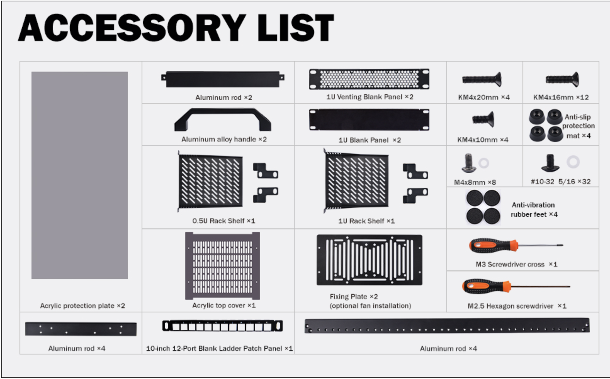

# Rack mounting - 2026 Q4
Moving Vandelay Industries from a desk pile into a 10" mini rack. Goals: neat, quiet, one power source instead of a brick per device, and room for the Pi node group to come back later.

## As built - phase 1 (2026-10-05)

    
    

Differs from the [original layout plan](#layout---original-plan): the router went inside the rack instead of on the top cover, the blades moved up right under it, and the switch rides on the blade shelf. The power bricks fit at the bottom, with cables run down through the open middle.

| Position | What | Mounting |
|---|---|---|
| Top, ~2U | Router (Kramer, UniFi Express 7) | Shelf |
| Below router, ~3U | 4x N100 blades: Art, spare slot, George, Elaine, Jerry | 3D printed 5-slot mount on the included 1U shelf |
| Behind the blades | Switch (D-Link DGS-105, 5 port) | Sits on the same 1U shelf |
| Middle | Open - power cables run down to the bottom | Free for the Pi node group / cable management |
| Bottom | Node power bricks | On top of the PDU |
| U1 | AC PDU | Rack ears |

Blade shelf before going in - blades, switch and patch cables on the 1U shelf:

    

- Bridge Pi isn't in the rack: the wall Ethernet works again, so it's stored away as a fallback. That's also why the router can sit inside the metal frame - no Wi-Fi upstream to protect
- [ ] Confirm exact U positions

## Rack: GeeekPi DeskPi RackMate T2 (12U)
10.23"D x 10"W x 21"H. Aluminum frame, acrylic sides, open front/back, 10-32 threaded rails (no cage nuts).

### Included in the box
| Item | Qty | Plan |
|---|---|---|
| 1U rack shelf | 1 | N100 blade mount (U5) |
| 0.5U rack shelf | 1 | Switch (U12) |
| 10" 12-port blank ladder patch panel | 1 | Phase 2 (needs keystones) |
| Fixing plate (optional fan mount) | 2 | Rear fans behind the node section |
| 1U venting blank panel | 2 | Spare U near the nodes (air intake) |
| 1U blank panel | 2 | Other spare U (keeps airflow going through the nodes) |
| Acrylic top cover (vented) | 1 | Router + bridge Pi sit on top - acrylic doesn't block Wi-Fi |
| Acrylic protection plate (sides) | 2 | Closes the sides so airflow is front-to-back |
| Aluminum rods (frame) | 2 + 4 + 4 | Frame |
| Aluminum alloy handle | 2 | |
| Anti-slip mats / anti-vibration feet | 4 / 4 | |
| #10-32 5/16 screws + washers | 32 | Rack mounting - design printed faceplates for these |
| KM4x20 / KM4x16 / KM4x10 / M4x8 screws | 4 / 12 / 4 / 8 | Frame assembly |
| M3 cross + M2.5 hex screwdriver | 1 + 1 | |

## Orders
| Date | Item | Status |
|---|---|---|
| 2026-09-27 | GeeekPi DeskPi RackMate T2 12U | Received |
| 2026-09-27 | [10" 1U rack PDU, 6 outlets (4 rear + 2 front), 2x USB-A, 1020J surge, 14AWG 6ft](https://www.amazon.com/dp/B0G1M1ZWP4) | Received |

## Phase 0.5 - tidy first, mount later
Rack + AC PDU only. Cased nodes sit loose on a shelf, no printing or stripping yet. Ollama is moving off the cluster (to the media PC with a GPU), so node heat is low for now.

| Position | What | On |
|---|---|---|
| Top | Router + bridge Pi | Acrylic top cover |
| U12 | Switch | Included 0.5U shelf |
| U7-5 | 4x N100, cased, stood on end side by side (~4.5" tall, ~7" wide) | Included 1U shelf in U5 |
| U2 | Power bricks | Try without a shelf first - extra 1U shelf if needed |
| U1 | AC PDU | Rack ears |
| Gaps | | Included blanks |

Need beyond rack + PDU:
- [ ] Maybe: 1 extra 1U shelf for the bricks (box only has one 1U + one 0.5U)
- [ ] Short 1-to-3 splitter cord (plain, not surge protected) - only if the switch isn't 5V
- [ ] Velcro ties
- [ ] Short patch cables (~1ft) - optional, biggest tidiness win
- [ ] Something to keep the standing nodes from tipping - velcro strap around all 4 is enough
- [ ] Check which way the case vents face when stood on end (not resting on the intake)

Move day - everything goes offline anyway (network moves too), so do a planned full shutdown instead of draining one by one:
- [ ] Set BIOS restore on AC power loss = Power On while the nodes are still easy to reach
- [ ] `sudo shutdown now` on workers (Jerry, Elaine, George), then the control plane (Art)
- [ ] Rack everything, power up Art first, then the workers
- [ ] Check `kubectl get nodes` and Longhorn volumes are healthy

## Layout - original plan
Superseded by [As built](#as-built---phase-1-2026-10-05) where they differ.

| Position | What | Mounting | Status |
|---|---|---|---|
| Top | Router (Kramer) + bridge Pi | Sitting on the vented acrylic top cover - outside the metal, bridge Pi's upstream is Wi-Fi | Decided |
| U12 | Switch (Varnsen) | Included 0.5U shelf, or a printed 1U faceplate (1U shelf goes to the nodes) | Decided (mount TBD) |
| U11 | Patch panel | Included 0.5U 12-port blank ladder panel | Phase 2 |
| U10-9 | Pi 4 nodes (Frank, Morty, Newman) | TBD - printed or DeskPi Pi mount | Phase 2 |
| U8 | Spare / cable management | Blank | Flexible |
| U7-5 | 4x N100 (Jerry, Art, Elaine, George) + 1 spare slot | Stripped blades standing on end in a printed 5-slot mount, screwed horizontally into the included 1U shelf (U5) | Mount printed |
| U4-3 | Spare - more Pis (U3 overflow for power bricks if needed) | Included vented blanks | Reserved |
| U2 | Existing power bricks, lying flat | Shelf | Phase 1 |
| U1 | AC PDU - 1U, 4 rear + 2 front outlets, 2x USB-A, surge protected | Rack ears | Ordered |
| Rear of U7-5 | Rear fans | Included fan fixing plates | Fan size TBD |

### N100 blades (U7-5)
Nodes are GMKtec NucBox G3 (case 115 x 107 x 44.5mm). Bare board is 107 x 107 x 28mm (4.2" x 4.2" x 1.1") - verify on the first stripped board.
- Height: 4.2" board + ~0.25" base = ~4.45" -> 3U (5.25"), ~0.8" spare for cable routing / airflow under the boards. 2U (3.5") is too short.
- Width: ~8.7" usable across the rack.

| Blades | Pitch | Air gap | |
|---|---|---|---|
| 6 | 1.45" | ~0.35" | Tight |
| 5 | 1.74" | ~0.65" | Workable - chosen |
| 4 | 2.17" | ~1.05" | Comfortable |

Mount: 3D printed, 5 fixed slots along the included 1U shelf (U5), screwed horizontally into the shelf so the mount and shelf are one rigid unit. 4 slots used now, the 5th is room for a 5th node (replaces the earlier adjustable slotted-rail idea).

Airflow notes:
- Each gap is shared by one board's fan side and the next board's NVMe side - face all blades the same direction.
- NVMe heatsinks go on the side facing the gap, where the rear fans pull air front-to-back.

To measure on the first stripped board:
- [ ] Bare board length x width
- [ ] Tallest part on top (cooler) and underneath (NVMe + heatsink)
- [ ] Stock fan intake / exhaust direction

## Power
### Phase 1 - AC PDU, keep existing bricks
One mains cord into the rack -> 1U AC PDU (U1) -> existing bricks on a shelf (U2).

PDU: 4 rear + 2 front AC outlets, 2x USB-A (wattage unlisted), 1020J surge protection. Bricks are inline (cord between plug and brick), so outlets aren't blocked.

| Device | Supply | Outlet |
|---|---|---|
| 4x N100 (G3) | 12V 3A (36W) brick, 5.5 x 2.5mm barrel, center positive | Rear 1-4 |
| Router (UniFi Express 7) | TBD - check label | Front 1 |
| Switch (TP-Link) | TBD - check label. If 5V: USB-A -> 5.5mm barrel cable | USB-A, else splitter |
| Bridge Pi | 5V 3A USB-C (TBD - check label) | Not in use - stored (wall Ethernet works again). If it comes back: Front 2, not the PDU's USB-A (likely <3A, and it's the only internet link) |
| Spare | | Splitter on a front outlet when needed (switch if not 5V, phase 2 Pis) |

Extra outlets come from a plain 1-to-3 splitter cord. Never chain a surge-protected strip into this PDU.

Phase 2 Pis (3 more): front outlets / splitter with a proper 5V 3A supply each, or move to phase 2 power.

Draw: N100 ~6-9W idle, ~20-25W all cores busy. Whole rack ~55W typical, ~130W worst case (+~25W with phase 2 Pis).

### Phase 2 (maybe) - single 12V DC supply
One ~180W (15A) 12V enclosed brick (e.g. Mean Well GST series) -> DC distribution -> nodes, with 12V->5V USB-C bucks (5.1-5.2V) for Pis/router/switch.
- DeskPi DC PDU Lite (0.5U) caps at 8A total (96W) - would need two, each with its own brick
- Its outputs are 5.5 x 2.1mm, nodes take 5.5 x 2.5mm - need 5521-to-5525 male-male cables
- Never feed it anything but 12V - it passes input voltage straight through

## Still to source
- [x] Node blade mount - 5 slots, screwed into the 1U shelf (3D printed)
- [ ] Node blade mount design files into the repo - PR from whoever printed it
- [ ] Switch faceplate (optional, 3D print)
- [ ] Rear fans - check what size the fixing plate takes
- [x] AC PDU - ordered 2026-09-27 (see Orders)
- [ ] Plain 1-to-3 splitter cord
- [ ] Maybe: USB-A -> 5.5mm barrel cable for the switch (if its brick is 5V)
- [ ] Maybe later: small UPS upstream of the PDU
- [ ] Velcro ties for DC cable slack
- [ ] Short slim patch cables, color coded
- [ ] Phase 2: 2.5GbE switch with 10+ ports, keystones for the patch panel, Pi mounts

## Before moving anything
- [ ] Baseline temps under load (e.g. `stress-ng --cpu 4`): `sensors`, `nvme smart-log /dev/nvme0`
- [ ] BIOS: restore on AC power loss = Power On, on every node
- [ ] Check brick labels: node PSU voltage/amps, switch PSU voltage
- [ ] Move one node at a time: `kubectl drain`, wait for Longhorn to rebuild before the next
