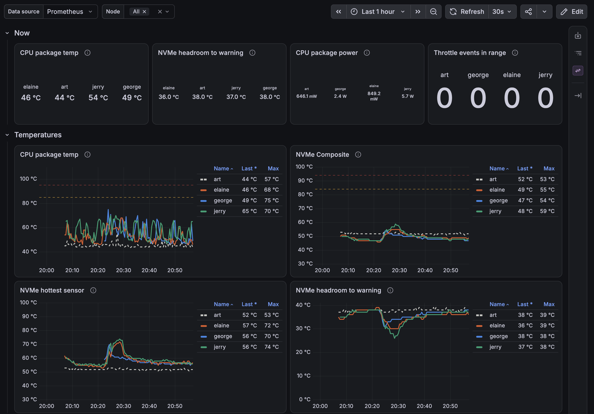

# Thermals & power - 2026 Q4
Next project after the [rack move](../rack_mount_setup/rack_mounting_2026-Q4.md). Goals: a real baseline of temps vs load vs ambient, then passive cooling and power trimming where the numbers say it's worth it.

Order matters: monitoring first, baseline second, then change **one thing at a time on one node** with the other workers as the control group. George, Elaine and Jerry are identical (same board, BIOS, RAM, SSD), which makes that easy.

## What the nodes expose (checked 2026-10-07)
| Signal | Available? | Where |
|---|---|---|
| CPU package + per core temp | Yes | hwmon `coretemp`. TjMax 105°C |
| NVMe temp | Yes | hwmon `nvme`. P3: Composite + Sensor 1/2/8, SN850X: Composite only |
| NVMe warn / crit thresholds | Yes, no root needed | hwmon `temp1_max` / `temp1_crit` |
| CPU throttle events | Yes | `/sys/devices/system/cpu/cpu*/thermal_throttle/` - all 0 since last boot |
| CPU package power (RAPL) | Root only | `/sys/class/powercap/intel-rapl:0/energy_uj` is `0400` |
| `acpitz` | Looks fake | 27°C on all 4 nodes - check it moves under load, else ignore |
| RAM temp | No | DDR4 SO-DIMM, no sensor - needs a probe |
| Fan RPM | No | No EC/fan driver - stock fan isn't visible to Linux |
| Wall power | No | Needs a metering plug |
| Ambient | No | Needs a sensor |

Power limits set by the BIOS: PL1 10W, PL2 15W (N100 spec is 6W). Governor `powersave`, ASPM policy `default`.

### First reading
In the rack, light load, ambient unknown - a single snapshot, not a baseline.

| Slot | Node | SSD | CPU pkg | NVMe Composite | NVMe Sensor 2 | NVMe warn / crit |
|---|---|---|---|---|---|---|
| 1 | Art | WD Black SN850X 2TB | 46°C | 52°C | - | 89 / 93°C |
| 3 | George | Crucial P3 4TB | 49°C | 46°C | 53°C | 84 / 94°C |
| 4 | Elaine | Crucial P3 4TB | 46°C | 46°C | 53°C | 84 / 94°C |
| 5 | Jerry | Crucial P3 4TB | 45°C | 45°C | 55°C | 84 / 94°C |

- Sensor 2 on the P3s runs ~7-10°C over Composite. The warn/crit thresholds apply to Composite.
- Art has the SN850X, not a P3 like the [hardware README](../README.md#node-group-x86-intel-n100) says. It's also the hottest drive at idle.

## Phase 1 - Monitoring
kube-prometheus-stack, setup in [cloud_setup, Monitoring](../../cloud_setup/README.md#monitoring). Changes from the [legacy Pi values](../../legacy_work/kubernetes/monitoring/kube-prometheus-stack/values.yaml):
- Scrape interval 30s (2m is too coarse to see a stress run ramp up)
- Retention 90d + `retentionSize` guard, 30Gi Longhorn volume - the baseline should span weeks, ideally a season change
- Dropped the Pi textfile temperature script - node-exporter's hwmon collector already covers coretemp and NVMe
- k3s-internal control plane monitors off, Alertmanager off

Dashboards ([as code](../../cloud_setup/monitoring/dashboards/)): "Vandelay / Overview" for the high-level cluster view, "Vandelay / Thermals & Power" for the detail below. First hour of data, 2026-10-08:

    

### What to collect
| Signal | Metric | Source |
|---|---|---|
| CPU temp | `node_hwmon_temp_celsius{chip=~".*coretemp.*"}` | node-exporter |
| NVMe temps + limits | `node_hwmon_temp_celsius{chip=~".*nvme.*"}`, `node_hwmon_temp_max_celsius`, `node_hwmon_temp_crit_celsius` | node-exporter |
| CPU throttling | `node_cpu_package_throttles_total`, `node_cpu_core_throttles_total` | node-exporter |
| CPU clock | `node_cpu_scaling_frequency_hertz` | node-exporter |
| CPU load | `rate(node_cpu_seconds_total{mode!="idle"})`, `node_pressure_cpu_waiting_seconds_total` | node-exporter |
| RAM | `node_memory_MemAvailable_bytes` | node-exporter |
| SSD load | `rate(node_disk_io_time_seconds_total)`, `rate(node_disk_written_bytes_total)`, `rate(node_disk_read_bytes_total)` | node-exporter |
| CPU package power | `rate(node_rapl_package_joules_total)` = watts | node-exporter, needs readable RAPL |
| Wall power | Watts + Wh total | Metering plug |
| Ambient / intake / exhaust / RAM | °C | ESP32 probes |
| SSD throttle history | Warning Temperature Time, Thermal Management T1/T2 counts | `nvme smart-log` before/after each test, or smartctl_exporter later |

Load notes:
- Use CPU utilization + PSI, not load average. Load average counts tasks blocked on IO: Elaine sat at ~8.8 on 4 cores while ~99% idle, because of one task stuck on an NFS mount (see [side findings](#side-findings)).
- RAM heat comes from bandwidth, not GB used, and nothing here measures bandwidth. Use a known memory stress load instead, and a probe on the stick.

### Gaps to fill
**RAPL readable by node-exporter.** `energy_uj` is root-only on purpose (PLATYPUS side channel, CVE-2020-8694). On a single-tenant homelab, opening it up is a fair trade. The node-exporter chart has a switch for it (`permissionInitContainer.fixes.rapl`): an init container gives node-exporter's group read access on every pod start, so nothing to set up on the nodes. On in [values.yaml](../../cloud_setup/monitoring/values.yaml).

RAPL covers the CPU package only - no SSD, NIC, RAM, Wi-Fi card or PSU loss. Wall power is the real number.

**Wall power.** Metering smart plug with a local API, e.g. Shelly Plug US (Gen2 or later): `http://<ip>/rpc/Switch.GetStatus?id=0` gives `apower` (W) and `aenergy.total` (Wh), and there are Prometheus exporters for it.
- Plug 1: PDU input - whole rack, always on
- Plug 2: "probe" - moved to whichever node brick is being tested. Includes the brick's loss, which is what you pay for

**Ambient.** ESP32 + DS18B20 probes on one 1-wire pin, ESPHome with its built-in `prometheus:` endpoint. Doesn't depend on any node, and probes go wherever:
- Room, away from the rack
- Rack intake (front) and exhaust (rear, behind the blades)
- Top, under the router shelf
- Taped onto one worker's SO-DIMM - the only way to get a RAM temp

Prometheus has to reach it - lab VLAN, or a firewall rule from the lab to the IoT VLAN.

Bluetooth sensors (Govee, Xiaomi) would need the Bluetooth radio the nodes might be losing in phase 3.

## Phase 2 - Baseline
**Passive:** 1-2 weeks of normal running. Shows the daily cycle, positional offsets between slots, and how much ambient swings.

**Active:** a scripted stress run, as a k8s Job pinned per node (`nodeSelector: kubernetes.io/hostname`) so it's in the repo and repeatable.

| Phase | Load | Duration |
|---|---|---|
| Idle | Nothing | 30 min |
| CPU | `stress-ng --cpu 4` | 20 min |
| Cool down | | 15 min |
| Memory | `stress-ng --vm 2 --vm-bytes 4G` (also loads CPU - compare against the CPU phase) | 20 min |
| Cool down | | 15 min |
| SSD write | `fio --rw=write --size=32G --direct=1` to a scratch dir | until done |
| SSD read | `fio --rw=randread --bs=128k --iodepth=32 --direct=1 --time_based --runtime=20m` on the same file - reads don't wear the drive | 20 min |
| Cool down | | 15 min |
| All at once | CPU + memory + SSD read | 20 min |

Run it on one node alone, then on all three workers at once (rack heat soak).

Record per phase: steady-state temps (average of the last 5 min), peak, minutes to steady state, throttle counts, RAPL watts, wall watts, intake temp.

**Normalize to ambient.** Compare ΔT over intake temp, not raw °C - otherwise a warm week looks like a failed experiment.

## Phase 3 - Experiments
One change, one worker. The other two workers are the control. Rerun the same stress Job before and after.

| # | Change | Expected | Cost to revert |
|---|---|---|---|
| 1 | SSD heatsink | Lower NVMe temps under sustained IO, fewer T1 throttle transitions. Clear win - roll out to all after the A/B | Low |
| 2 | Bluetooth off in software (blacklist `btusb`) | Small or no watts saved | Delete one file + reboot |
| 3 | Pull the Wi-Fi/BT card | Unknown - see below. Watch idle watts + package C-states | Plug it back |
| 4 | 25x25mm fins on measured hot spots | Lower local temps, only where there's airflow | Peel off |
| 5 | Lower PL1 to 6W at runtime | Less heat + power under load, slower all-core work. Idle unchanged | Reboot |
| 6 | `pcie_aspm.policy=powersupersave` | Lower idle. Watch the I226-V for link drops | Remove the kernel arg |

PL1 at runtime (root, resets on reboot): `echo 6000000 > /sys/class/powercap/intel-rapl:0/constraint_0_power_limit_uw`. If it errors, the BIOS locked it and it's a BIOS setting instead.

Package C-state residency before/after #2, #3, #6: `turbostat` (Debian package `linux-cpupower`), the `Pkg%pc*` columns.

### Wi-Fi / Bluetooth card
- Realtek RTL8852BE: Wi-Fi 6 on PCIe (`10ec:b852`), Bluetooth on USB (`0bda:b85b`), same card. Nodes run on Ethernet, so neither half is used
- The Wi-Fi side has no driver bound and runtime PM is `on`, so the card sits powered and unmanaged. The Bluetooth side is driven by `btusb`
- Hypothesis: an unmanaged PCIe device can keep the link and package out of deeper idle states. N100 mini PCs are known for shallow package C-states, and that's where any savings would show up. Could be a watt per node, could be nothing - the plug decides
- Removal: power off, anti-static strap, lift the two antenna leads straight up off their sockets, remove the screw, pull the card. Kapton the loose antenna ends so they can't short or reach the fan
- Keep the cards, labeled per node. Wi-Fi has been the fallback uplink before
- While in the BIOS: look for Wireless / Bluetooth / Audio / ASPM / C-state options, and note the PL1/PL2 settings. Combine with the open rack to-do "restore on AC power loss = Power On"
- A freed M.2 E-key slot could take something else later

### Passive cooling notes
- Find hot spots before adding fins: IR thermometer or a probe right after the CPU stress phase. Candidates: Intel I226-V NIC chip, VRM area next to the CPU, the SO-DIMM. Fins where it isn't hot do nothing
- Clearance: the ~0.65" (16.5mm) gap between blades is shared by one board's fan side and the next board's NVMe side. Fin height + SSD heatsink height must leave air between them - measure both before sticking anything
- Orientation: blades stand vertical, so with no fans air rises - run fin channels vertically. If the rear fans go in, front-to-back
- Non-conductive thermal tape only. No fin edge touching exposed pads or component legs. On vertical boards, use tape rated for the heat (e.g. 3M 8810) or a clip
- Shiny metal reads wrong on an IR thermometer - stick Kapton on the spot and measure that

## Energy math
Every watt always on = 8.76 kWh/yr. At ~$0.17/kWh (check the bill) that's ~$1.50/yr per watt.

| Load | kWh/yr | $/yr |
|---|---|---|
| Rack at ~55W (estimate from the rack doc) | ~480 | ~$80 |
| 1W saved on each of 4 nodes | ~35 | ~$6 |

The savings are small money. The real wins are the data, less heat in a closed rack, and headroom for the Pi group.

## To source
| Item | Qty | For |
|---|---|---|
| Metering smart plug, local API (e.g. Shelly Plug US Gen2+) | 2 | Rack total + per-node probe |
| ESP32 dev board | 1 | Ambient sensor hub |
| DS18B20 probes + 4.7kΩ pull-up | 5 | Room, intake, exhaust, top, SO-DIMM |
| Non-conductive thermal tape | 1 | Fins |
| Kapton tape | 1 | Antenna leads, probes, IR targets |
| IR thermometer (optional) | 1 | Hot spot hunting |
| Anti-static wrist strap | 1 | Card removal |
| SSD heatsinks | 4 | Incoming |

## Side findings
- [ ] Art has a WD Black SN850X 2TB, not a Crucial P3 4TB - fix the [hardware README](../README.md#node-group-x86-intel-n100) specs
- [ ] Elaine: kernel thread for an NFS mount (`10.43.3.214`, probably a Longhorn RWX share-manager) stuck in D state, pushing load average to ~8.8 while the CPU is idle
- [x] George: `kubectl top` showed `<unknown>`, and node-exporter crash looped on install. k3s still had George at `10.10.0.189` after DHCP moved it to its UniFi fixed IP `10.10.0.101` - kubelet probes, metrics-server and flannel all used the dead address. Fixed 2026-10-08 by restarting `k3s-agent`
- [ ] `scheduler/airflow-triggerer-0` on Elaine is in `Init:CrashLoopBackOff`

## To do
- [x] Phase 1: kube-prometheus-stack values + install script under `cloud_setup/monitoring/`
- [x] Phase 1: install it, all targets UP, `node_rapl_package_joules_total` shows up for all 4 nodes
- [ ] Phase 1: order plugs + ESP32/probes, ESPHome config into the repo
- [x] Phase 1: Grafana dashboard - temps, watts, load per node ([thermals-power.json](../../cloud_setup/monitoring/dashboards/thermals-power.json))
- [ ] Phase 1: dashboard - add ΔT over intake + wall watts once the ESP32 and plugs are in
- [ ] Phase 2: stress Job manifest, 1-2 weeks passive data, first active run
- [ ] Phase 3: experiments in the order above, results table per experiment in this doc
