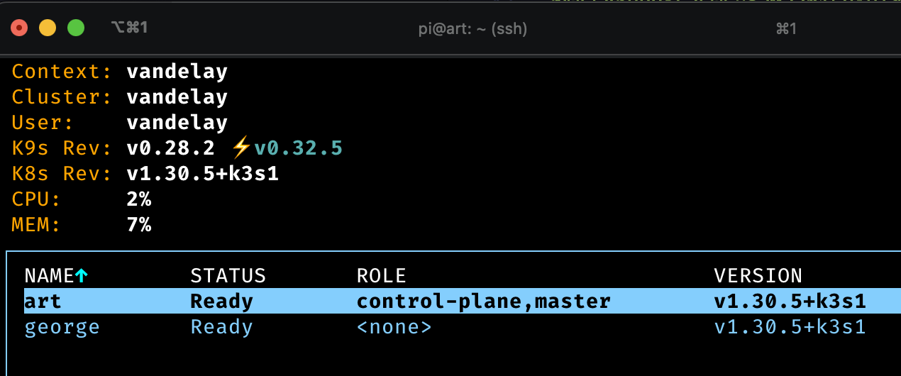

# Pi cluster kubernetes & basic infra
I'm using k3s, is a minimalistic distro and works well with PIs

start with `hardware/pi_setup` which will enable cgroups


## Kubernetes core cluster
*NOTE:* kubernetes runs etcd as a database, which is write intensive. need good IO and SSD drives will help us

### Set up master
```bash
curl -sfL https://get.k3s.io | sh -

# fetch the token
sudo cat /var/lib/rancher/k3s/server/node-token

# show the kubeconfig content so you can add to laptop kube contexts
sudo cat /etc/rancher/k3s/k3s.yaml
```

### Set up nodes
for each node:
```bash
export K3S_TOKEN=...
export K3S_URL="https://art:6443"

curl -sfL https://get.k3s.io | sh -
```

### Add cluster to context
useful to run kubectl commands from laptop on local network
https://kubernetes.io/docs/tasks/access-application-cluster/configure-access-multiple-clusters/

I use k9s to manage my deployment


### run a test pod to see

## Networking setup

Mostly I will be using cloudflare zero trust to expose anything to public

Internally i would like to have a loadbalancer so that i can reach some components like longhorn gui, airflow,.. ,from within network.

### Metal LB setup

```bash
helm repo add metallb https://metallb.github.io/metallb
helm upgrade --install metallb metallb/metallb --create-namespace \
    --namespace metallb-system --wait
```


metal LB needs some configuation resources as well. 
- lookup DHCP IP range for router and 
- make sure that you set an ip range which is not automatically assigned.


```bash
kubectl apply -f metworking/metallb-cr.yaml
```

### Cloudflare setup
...


## persistent storage on cluster

### block storage using longhorn
quite easy to set up. there are no special considerations in my case since i have one disk per cluster right now.

use ansible or run on each node to get requirement

```bash
sudo apt update && sudo apt install open-iscsi
```

install longhorn using helm:

```bash
helm repo add longhorn https://charts.longhorn.io
helm repo update
helm install longhorn longhorn/longhorn --namespace longhorn-system --create-namespace
```


#### Using a subset of workers for longhorn?
cluster is too small at the moment but many people seem to only allocate a few nodes to longhorn.
using taints/tolerations to route more stateful pods to those nodes? available from all nodes still?

#### Backup
can back up to S3 or NFS

### object storage solutions?
to be explored
- minio
- ceph
