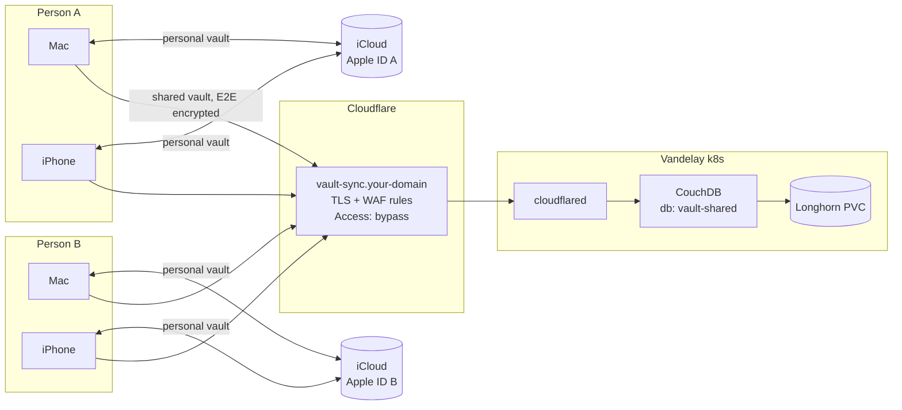

# Obsidian for two - personal vaults + a shared vault synced through Vandelay
**Status:** Draft spec - 2026-10-02. Parked - re-evaluate with [Relay](https://relay.md) for the shared vault (real-time co-editing with live cursors, which LiveSync lacks) before implementing.

Two people, each with a Mac and an iPhone. Each person keeps a **personal vault** only they see. Both share **one shared vault**: home projects, cooking, trips, plans. Every vault works on every device the owner uses, offline included.

Personal vaults sync over iCloud (free, and works within one Apple ID). The shared vault can't: Obsidian on iOS only opens vaults in its own iCloud folder, and a folder shared from another Apple ID never ends up there. So the shared vault syncs through a CouchDB on the cluster using the [Self-hosted LiveSync](https://github.com/vrtmrz/obsidian-livesync) community plugin.

## Goals
- Shared vault readable/writable on all 4 devices (2x Mac, 2x iPhone)
- Offline first - a cluster outage delays sync, never blocks writing
- Server only stores end-to-end encrypted data
- No Obsidian subscription (Obsidian Sync would be ~$96/yr for two, every collaborator needs a seat)
- Onboarding the second person is "paste a link + passphrase", no terminal
- Pattern generalizes: another shared space = another database + role, same server

## Non-goals (v1)
- Real-time co-editing with live cursors (Google Docs style) - if that turns out to matter, look at the Relay plugin
- Groups with outside people (e.g. friends on a project) - the pattern supports it, not in scope yet
- Moving personal vaults off iCloud - possible later on the same server, see [Extending](#extending)
- AI tooling - works on the plain `.md` files on each Mac, independent of how they sync
- Android / Windows / Linux

## Architecture


How LiveSync works, briefly: each device keeps a local database next to the vault's `.md` files and replicates it with CouchDB (CouchDB's built-in sync protocol). Notes are split into chunks and encrypted on the device before upload. Every device ends up holding the **full vault**, so the server is a meeting point, not the only copy.

### Where vaults live
| | Personal vault | Shared vault |
|---|---|---|
| **Mac** | `iCloud Drive/Obsidian/<name>` (the iOS app's folder) | `~/Vaults/Shared` - local, **not** under Desktop/Documents if "Desktop & Documents" iCloud sync is on |
| **iPhone** | Created with "Store in iCloud" **on** | Created with "Store in iCloud" **off** (On My iPhone) |
| **Sync** | iCloud, own Apple ID | LiveSync -> CouchDB |

Rule: never let two sync systems touch the same files. That's why the shared space is a separate vault, not a LiveSync folder inside the iCloud vault.

Trade-offs of a separate vault:
- `[[wikilinks]]` don't cross vaults. Use `obsidian://open?vault=Shared&file=...` links when needed
- Switching vaults on the iPhone takes a couple of taps
- Plugins/settings are configured per vault

## Server side

### Components
| Piece | Choice | Why |
|---|---|---|
| Namespace | `obsidian-sync` | |
| CouchDB | Official `couchdb:3.x` image, pinned tag, **single-replica StatefulSet** | Helm chart targets multi-node CouchDB clusters, which is more than we need. LiveSync documents single-node. Image is multi-arch |
| Storage | Longhorn PVC via `volumeClaimTemplates`, 10Gi, RWO | Notes are tiny. Photos/PDFs are the growth driver. Longhorn volumes expand online |
| Placement | `nodeSelector: node-type: big` | Keep the volume on the N100 group |
| Resources | req 100m / 256Mi, limit 1 CPU / 1Gi | Two people's notes are a light load |
| Probes | `tcpSocket` on 5984 | `/_up` needs auth once `require_valid_user` is on |
| Admin secret | `create_secret.sh` reading `op://vandelay/couchdb/...` | Same pattern as `services/database` |
| Exposure | Route in the existing cloudflared tunnel -> `http://couchdb.obsidian-sync.svc.cluster.local:5984` | Phones need a public, valid HTTPS cert. The tunnel gives that without opening ports |

### CouchDB config
Mounted from a ConfigMap as a **single file** (`subPath`) at `/opt/couchdb/etc/local.d/10-livesync.ini`. Mounting the whole `local.d` directory read-only breaks the image's entrypoint, which writes `docker.ini` there. Values mirror what LiveSync's own provisioning script sets:

```ini
[couchdb]
single_node = true
max_document_size = 50000000

[chttpd]
require_valid_user = true
max_http_request_size = 4294967296
enable_cors = true

[chttpd_auth]
require_valid_user = true

[httpd]
WWW-Authenticate = Basic realm="couchdb"
enable_cors = true

[cors]
credentials = true
origins = app://obsidian.md,capacitor://localhost,http://localhost
headers = accept, authorization, content-type, origin, referer
methods = GET, PUT, POST, HEAD, DELETE
max_age = 3600
```
`app://obsidian.md` is Obsidian desktop, `capacitor://localhost` is Obsidian iOS.

### Users, databases, access
One **database per shared space**, one **CouchDB user per person**, access granted through a **role named after the space**. Devices never use the CouchDB server admin.

```bash
# via kubectl port-forward, as server admin
# users
PUT /_users/org.couchdb.user:person-a  {"name":"person-a","password":"<1pw>","roles":["vault-shared"],"type":"user"}
PUT /_users/org.couchdb.user:person-b  {"name":"person-b","password":"<1pw>","roles":["vault-shared"],"type":"user"}

# space
PUT /vault-shared
PUT /vault-shared/_security  {"admins":{"names":[],"roles":["vault-shared"]},"members":{"names":[],"roles":["vault-shared"]}}
```
- Role in `admins` as well as `members`: database admins can write design docs, which LiveSync may need. That's still limited to this one database, not the server
- Removing someone = delete their user. The other person doesn't re-key anything
- Wrapped in an idempotent `provision.sh <space> <user...>` that reads passwords from 1Password

### Cloudflare
- **Public hostname:** `vault-sync.<domain>` -> tunnel -> CouchDB service
- **Access:** Cloudflare Access login pages break the plugin's HTTP calls. Add an Access application for this hostname with a **Bypass** policy, so it overrides any wildcard app. Auth is CouchDB's own, on top of E2E encryption
- **WAF custom rule:** block `/_utils*` (Fauxton admin UI) and `/_node*` from the internet. Admin work goes through `kubectl port-forward`
- **Rate limiting rule** (free plan has one): throttle repeated `401`s on the hostname
- Cloudflare limits: 100MB per request on the free plan, 100s to first response byte. LiveSync sends chunked batches, so this should be fine. Verify in the pilot, and lower LiveSync's batch size if uploads fail

## Client side

### LiveSync settings for the shared vault
| Setting | Value | Why |
|---|---|---|
| Remote type | CouchDB | |
| URI / database | `https://vault-sync.<domain>` / `vault-shared` | |
| Username / password | Own per-person user | |
| End-to-end encryption | **On** - passphrase in 1Password | Server and Cloudflare only see ciphertext |
| Path obfuscation | **On** | Hides file names on the server too |
| Sync mode - Mac | LiveSync (continuous) | |
| Sync mode - iPhone | Periodic + sync on start / file open / save | iOS suspends Obsidian in the background anyway; it catches up on open |
| Hidden file / customization sync | **Off** | Keeps `.obsidian/workspace.json` churn out of sync. Each person picks their own theme/plugins |
| Conflicts | Auto-merge simple Markdown conflicts, otherwise ask | |

Also turn on the core **File Recovery** plugin in the shared vault. It keeps per-device snapshots of every note, so an individual bad edit can be undone without touching the server.

### Onboarding
1. **Person A, Mac** - create the empty local vault `Shared`, install Self-hosted LiveSync, enter the remote settings, set the E2E passphrase, initialize the remote from this device
2. **Person A, Mac** - generate a **Setup URI** (encrypted with a setup passphrase). Apply it on Person A's iPhone (new vault, "Store in iCloud" off -> install plugin -> "Use setup URI" -> fetch from remote)
3. **Person B, Mac** - same steps with the URI, then swap username/password to `person-b` in the remote settings. Generate a fresh Setup URI from here for Person B's iPhone
4. Share the URI through 1Password or AirDrop. It contains credentials, so not iMessage

## Backups and failure modes
Layers, cheapest first:
1. **Every device is a full copy** - losing the server loses no notes
2. **File Recovery core plugin** - per-device undo for single notes
3. **Longhorn recurring snapshots** on the CouchDB PVC - daily, keep 14
4. **Off-cluster copy** - open question (Time Machine on the Macs covers `~/Vaults/Shared`?)

| Scenario | What happens | Action |
|---|---|---|
| Cluster down / rack move day | Everyone keeps editing locally | None - devices catch up when it's back |
| CouchDB volume lost | Server empty, devices intact | Recreate DB + users -> one Mac rebuilds the remote from local -> other devices re-fetch |
| Bad sync (mass deletion) pushed to all devices | Devices and server agree on the bad state | Scale CouchDB to 0 -> revert PVC to a snapshot -> scale up -> on **every** device, "reset local database and fetch from remote" (otherwise devices push the deletion back up) |
| E2E passphrase lost | Server data unreadable | Devices still have plaintext. New DB + new passphrase, rebuild from one device. Keep the passphrase in 1Password |
| Password leaked | Attacker can download ciphertext / write junk | Delete + recreate that user. Restore from snapshot if junk was written |

## Risks
| Risk | Mitigation |
|---|---|
| Internet-facing CouchDB | Long random passwords, no admin creds on devices, admin paths blocked at the WAF, rate limit, E2E encryption |
| Partner's notes depend on my cluster | Offline first + full local copies. An outage is a sync delay, not lost access |
| LiveSync is a community plugin, mostly one maintainer | Vault is plain `.md` files. Exit = point the folder at any other sync (Obsidian Sync, Relay, ...) |
| iCloud vault detection bugs on iOS (seen with iOS 26.5 / Obsidian 1.12.7) | Personal vaults can move onto this server, see below |
| Mac vault accidentally inside iCloud-synced Documents | `~/Vaults/` convention, check during onboarding |

## Extending
Each new space = `provision.sh <space> <users...>` + a Setup URI. No new infra.
- **Personal vaults off iCloud:** a space with one member (`vault-person-a`)
- **A group project with friends:** a space with N members. They each need a CouchDB user and the plugin. Worth comparing with Relay at that point, since friends may want real-time co-editing more than self-hosting

## Plan
| # | Milestone | Done when |
|---|---|---|
| 1 | CouchDB in cluster (`services/obsidian-sync/`) | `curl -u admin` via port-forward returns `_up` ok, `_users` exists |
| 2 | Provision `vault-shared` + two users | Non-admin user can read/write `vault-shared`, gets 403 on other DBs |
| 3 | Expose through tunnel + Access bypass + WAF | From an iPhone on cellular, the hostname answers with a Basic-auth challenge. `/_utils` is blocked |
| 4 | Pilot: Person A's Mac + iPhone, throwaway notes, ~1 week | Acceptance tests below pass |
| 5 | Onboard Person B | Both phones + Macs in sync |
| 6 | Snapshots + restore drill | Recurring job runs; one restore exercised end to end |

Deliverables in `services/obsidian-sync/`: `namespace.yaml`, `create_secret.sh`, `configmap.yaml`, `statefulset.yaml`, `service.yaml`, `provision.sh`, `README.md`.

### Acceptance tests
- [ ] Edit on Mac -> visible on the other person's iPhone within seconds of opening Obsidian
- [ ] Edit in airplane mode on iPhone -> syncs after reconnecting, nothing lost
- [ ] Both edit the same note offline -> merged, or a conflict prompt; never silent loss
- [ ] Photo attachment (~5MB) syncs Mac -> iPhone through Cloudflare
- [ ] Documents in Fauxton (via port-forward) show encrypted content and obfuscated paths
- [ ] CouchDB pod deleted -> devices reconnect on their own when it's back
- [ ] Snapshot restore drill completed

## Open questions
- Public hostname / domain to use
- Off-cluster backup: is Time Machine on the Macs enough?
- Does Person B use 1Password (for the passphrase and setup URI hand-off)?
- Pin CouchDB 3.5.x or newer - check the latest when implementing
