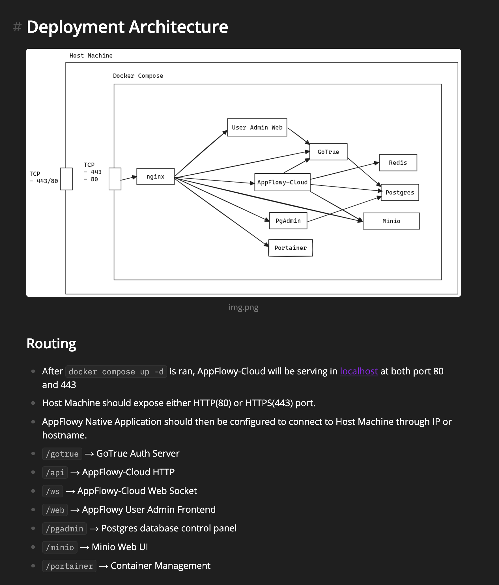

# general purpose notetaking using appflowy
Looking for an app somewhere in the landscape of Notion / Miro / chatGPT.
should sync across devices.

Appflowy seems to offer this open source. option to self-host cloud.

## install on k8s cluster
It seems [docs](https://github.com/AppFlowy-IO/AppFlowy-Cloud/blob/main/doc/DEPLOYMENT.md) offer docker compose

services running the environment:
- minio 
- postgres
- redis
  - used by appflowy-cloud
- nginx?
  - just handles a lot of connectivity stuff. can rely on k8s services & cloudflare instead?
  - is API interactions gonna be fudged?
- 
- gotrue?
  - seems to be with regards to Oauth,JWT, etc
  - used by appflowy cloud, nginx. uses psql
- code-specific
  - appflowy_cloud
  - admin_frontend
  - ai
  - appflowy_history
  - appflowy_worker

volumes mounted:
- postgres_data
- minio_data 

### My setup
- minio ✅ external
- postgres 🚧 need to setup db/user/pw
  - time to deploy pgadmin?
- redis 🚨 need to figure out
- gotrue / auth 🚨
- secret env vars file
- deployment yaml for code-specific

### reference: compose architecture
